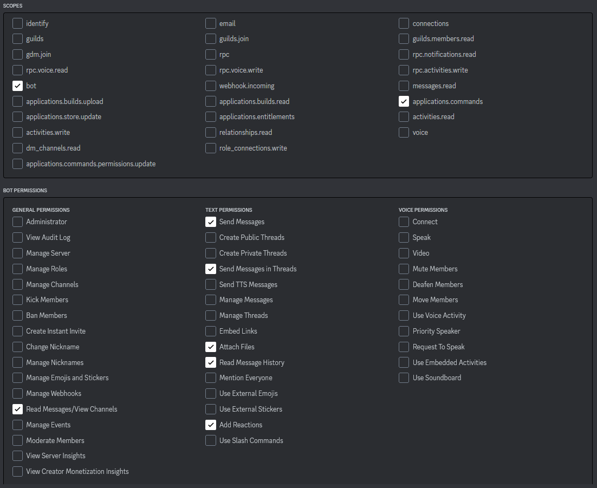

# Benji's RPG campaign utility Discord BOT
A discord bot for tracking campaign stats in a game of "Dungeons and Dragons" 
as well as helping to run a game of "Blades in the Dark"

---


## Table of Contents
* [Goal](#goal)
  * [Campaign Stats](#campaign-stats)
  * [Devils Bargains and Entanglements](#devils-bargains-and-entanglements) 
  * [Progress Clocks](#progress-clocks) 


* [Technologies](#technologies)
  * [Devils bargain card deck](#devils-bargain-card-deck)
  * [Expanded Entanglements Table](#expanded-entanglements-table)
  * [Clock images](#clock-images)


* [How it works](#how-it-works)
  * [Setup](#setup)
    * [.ENV](#.ENV)
    * [Permissions](#permissions)
  * [Running the Bot](#running-the-bot)
  * [Offline Mode](#offline-mode)
  

* [Commands](#commands)
  * [Blades in the Dark Commands](#blades-in-the-dark-commands)
    * [Devil's Bargains and Entanglement Commands](#devils-bargains-and-entanglement-commands)
    * [Progress Clock Commands](#progress-clock-commands)
  * [Campaign tracking commands](#campaign-tracking-commands)
    * [Management Commands](#management-commands)
    * [Stat Commands](#stat-commands)

---

## Goal
The bot was generally designed as a tool to help me with GMing tabletop roleplaying games, such as DnD and Blades in the Dark.
It mainly serves three purposes at the moment:
* Tracking [Campaign Stats](#campaign-stats) for one or multiple campaigns of DnD.
* Providing [Devils Bargains and Entanglements](#devils-bargains-and-entanglements) for games of Blades in the Dark
* Generating [Progress Clocks](#progress-clocks) in a Discord chat for games of Blades in the Dark and saving them permanently  

All of this functionality works via discords slash command system.

### Campaign Stats
The bot is designed to track multiple Player characters and their stats in multiple games of DnD 
at the same time. By stats I am not referring to the stats on a character sheet such as ability scores or skill scores, 
but overarching campaign stats, such as  

* enemies killed
* damage done
* damage taken

The bot keeps track of these stats over year long games with multiple sessions and stores them permanently.  
<strong>This feature is not yet fully implemented</strong>.  
Authorization changes still need to be accounted for, so players cannot access other peoples' 
game saves they are not allowed to access.

### Devils Bargains and Entanglements
On request, the bot sends a random Devil's Bargain Card, containing two devils bargains to get the GM thinking. 
These are for when you don't have an Idea or you just like the input.  
It can also show you the appropriate entanglements, depending on the amount of heat you have and what you rolled.

### Progress Clocks
After a request from someone on the BitD discord, I included the option to create clocks, tick them and output them.  
Though it is possible to create clocks of greater sizes and tick them, at the moment it is only possible to output images of clocks of size 4, 6 and 8, since the images are not created dynamically. All other clocks are only output via text.

---

## Technologies
Project is created with:  
Python: 3.10  
py-cord 2.1.3  
python-dotenv 0.20  

### Devils bargain card deck
The amazing *Devil's Bargain-Card Deck* was created by awesome reddit user *[u/Consistent-Tie-4394][db_user]*.  
You can look at his reddit post on the [BitD reddit][db_reddit]
or directly download it from his [google drive][db_drive].

### Expanded Entanglements Table
The, just as great, *expanded Entanglements Table* was created by the reddit user *[u/Lupo_1982][exp_ent_user]*.  
Check out his reddit post on the [BitD reddit][exp_ent_reddit]
or directly download the table from his [google drive][exp_ent_drive].

### Clock images
The Clock Images were **NOT** created by me, though I have been unable to find the source.  
If you are the creator, or find the page I got them from, please contact me, and I will include a link.

---

## How it works
The bot will be hosted on your own PC after you clone the repository. For the bot to work and react to your commands
you need to keep it running on your PC while you are using it.  
The bot **auto saves** all changes inside dedicated save files inside the *./saves* folder, so it is not required for you to run
a save command. The saves folder and according file is created when you add your first character.
Save files are saved in the standardized json format, which makes the data easily transferable.


### Setup 
1. All discord bots require a unique BOT-Token, which you get when you create a Discord bot on the [Discord Developer Website][discord_dev].
2. Once you are logged in, create a `new Application`
3. Within the application, enter the `Bot` tab and choose `Add Bot`
4. Still in the `Bot` tab under the bot's username is your bot's token. Copy that token and store it safely. Keep this token secret, do not publish this token anywhere. It can be misused by malicious third parties.  
If you cannot see it, select the button `Reset Token`. 
5. Continue the .ENV process outlined below

##### .ENV

After you have set up your discord bot and have your token, open the .env_example file inside the Bots root folder. It will look something like this:

```
DISCORD_TOKEN=""
COMMAND_CHAR="!"
CLOUD_SAVE_CHANNEL=
ADMIN_ID=
```

In order to get the bot running, you will have to paste the token you got from the Discord bots developer page in between the 
" " of the *DISCORD_TOKEN* variable and rename the `.env_example` file to `.env`.  
You are also required to set your own [discord id][discord_id] as the ADMIN_ID in order to ensure certain commands are locked for your own use alone.  
If you wish to be able to save your save files into a predetermined discord channel via the */cache* command, you can copy the channels discord id into the `CLOUD_SAVE_CHANNEL` variable. Just make sure the bot has access to the channel and authorization to post there.  
The COMMAND_CHAR variable is the assigned prefix for special admin commands such as "r". 
This will be removed soon though as I roll out the new system.

At the end of this process your .env file should look something like this (values are just examples):
```
DISCORD_TOKEN="youR241DiscordBotTokenPastedHERE"
COMMAND_CHAR="!"
CLOUD_SAVE_CHANNEL=1save24ChannelID
ADMIN_ID=231OfAdmin23UserID
```


These are the variables that can be assigned in the .env file.

| Variable           | Required | Use                                                                         |
|--------------------|----------|-----------------------------------------------------------------------------|
 | DISCORD_TOKEN      | YES      | bot token assigned by the discord developer page                            |
 | COMMAND_CHAR       | NO       | prefix used to use admin commands                                           |
 | CLOUD_SAVE_CHANNEL | NO       | channel id, in which the bot sends save files if the /cache command is used |
 | ADMIN_ID           | NO       | user id of user assigned as administrator                                   |

#### Permissions
To work properly, the bot requires these permissions, some of them are not yet used, but may be used in future versions. 
1. Once you are done with the setup above, enter into the OAuth tab on the Discord Developer page and select the URL generator.
2. Here you will need to select the permissions below and copy the URL at the bottom

3. Save this url somewhere, maybe in your bot's description. People will be able to invite your discord bot into their server, by using this url.
4. Enter the url into your browser and invite the bot to your discord server. 
5. Run the bot

### Running the Bot
In order to run the bot, you need to run main.py or use the included `start_bot.bat` file to run the bot.  
The bat file should also work if you have a virtual environment(venv) with all of the required packages inside of the root folder.  
The bot will then load up all of the Extensions and will work once it has logged in. 

### Offline Mode
Local Run is not working at the moment and is disabled for now.

---

## Commands
These are all the commands implemented so far, ordered by the Cogs they are assigned to.  

* parameters with a star (*) are optional parameters, default values are written in the use section  

### Blades in the Dark Commands
#### Devils Bargains and Entanglement Commands
|  command name  |        parameters        | Use                                                                                                                                 |
|:--------------:|:------------------------:|:------------------------------------------------------------------------------------------------------------------------------------|
 | devils_bargain |           *nr            | The bot will send a devils bargain card.<br> nr specifies the amount of cards, up to a maximum of 10. <br>**Defaults to one card.** |
 |    db_by_nr    |            nr            | The bot will send the Devils Bargain card with the id given                                                                         |
 |  entanglement  | number_rolled, crew_heat | The bot sends the entanglements related to the specified number rolled in the entanglement roll and the heat of the crew.           |


#### Progress Clock Commands
| command name |           parameters            | Use                                                                                                 |
|:------------:|:-------------------------------:|:----------------------------------------------------------------------------------------------------|
 |  add_clock   | clock_name, clock_size, *ticks  | Adds a new clock of a certain size and a certain amount of starting ticks. <br> **Default 0 ticks** |
 | remove_clock |           clock_name            | Removes the selected saved clock.                                                                   |
 |  show_clock  |           clock_name            | Prints a saved clock, with picture if possible.                                                     |
|  all_clocks  |                /                | Prints out all saved clocks.                                                                        |
|     tick     |       clock_name, *ticks        | Ticks the selected clock by a selected amount. <br>**Default: 1 tick, negative values possible**    |

---

### Campaign Tracking Commands
#### Management Commands
These are commands used to load files, manage characters and their assignment to discord users.

| command name |           parameters            | Admin Only | Use                                                                                                                                                                                                                                                 |
|:------------:|:-------------------------------:|:----------:|:----------------------------------------------------------------------------------------------------------------------------------------------------------------------------------------------------------------------------------------------------|
|     file     |            file_name            |     NO     | Load one of the save files.                                                                                                                                                                                                                         |
 |   add_char   | char_name, max_health, *user_id |     NO     | Adds new character to currently selected savefile and sets their name and maximum health. <br>If user_id is provided, it tries to claim the character for the user with the provided discord user id.                                               |
 | rename_char  |  old_char_name, new_char_name   |     NO     | Rename a character on the current save file.                                                                                                                                                                                                        |
 |    claim     |       char_name, *user_id       |     NO     | Tries to claim the character in the currently selected save file with this name for the discord user with the provided id of for the user calling the command if no user_id is provided. <br>**A user can only claim one character per save file.** |
|   unclaim    |            *user_id             |  DEPENDS   | Unclaims the character assigned to yourself, or the user_id provided. <br>**You can only unclaim other users characters, if you are an administrator**                                                                                              |
|   download   |                /                |     NO     | Sends a copy of the currently selected save file into the channel where the command was called                                                                                                                                                      |
|     undo     |                /                |     NO     | Undo your last command. You can undo a maximum of 10 commands. If you send a new command after undoing one or more commands, the undone commands are lost and cannot be redone via the redo command.                                                |
|     redo     |                /                |     NO     | Redo a command you've previously undone.                                                                                                                                                                                                            |
|    cache     |                /                |    YES     | Sends a copy of the currently selected save file into the channel with the id assigned in the .env file.<br>**Make sure the bot has the necessary access and permissions to send messages in the channel with the provided ID**                     |

#### Stat Commands

**All stat commands except for log have an optional `char_name` parameter and are applied to a users claimed character in the currently selected savefile if no `char_name` is provided**

| command name |         parameters         | Use                                                                                                                                                                                                                                                                                                                                   |
|:------------:|:--------------------------:|:--------------------------------------------------------------------------------------------------------------------------------------------------------------------------------------------------------------------------------------------------------------------------------------------------------------------------------------|
|     log      |         *advanced          | Output the stats of all characters in the currently selected save file.<br>Also outputs the commands that have been sent and can be undone/redone if the `advanced` parameter is set to 1                                                                                                                                             |
 |     crit     |         *char_name         | Increase the `crit` stat by one for the selected character.                                                                                                                                                                                                                                                                           |
 |    dodged    |         *char_name         | Increase the `dodged` stat by one for the selected character.                                                                                                                                                                                                                                                                         |
 |    cause     | amount, *kills, *char_name | Increases the `damage_caused` stat for the selected character by the provided `amount`. If kills are provided it also increases the `kills` stat by that amount. If the `amount` is greater than the characters previous `max_damage` stat, the stat will be replaced by the new amount                                               |
|     take     |     amount, *char_name     | Selected character takes provided amount of damage, decreasing their `health` stat and increasing the `damage_taken` stat. <br>If their health hits 0 or less it is reset to 0 and their `fainted` stat is also increased by 1. **This does not happen when taking damage while already at 0 health**                                 |
|    take_r    |     amount, *char_name     | Works the same as take, increasing `damage_taken` stat but only reduces `health` stat by half of the `amount` provided rounded down, to account for damage resistances provided by abilities, such as the barbarian in dnd 5e                                                                                                         |
|     tank     |     amount, *char_name     | Increases `damage_taken` stat without affecting the `health` stat at all. This accounts for temporary hitpoints or other abilities negating actual damage to a character, like polymorph in dnd 5e (only does damage to temporary form)                                                                                               |
|   set_max    | new_max_health, *char_name | Sets the `max_health` stat for the selected character to the chosen value.                                                                                                                                                                                                                                                            |
|     heal     |     amount, *char_name     | Heals the selected character by the chosen amount, never going over their `max_health` and increases the `damage_healed` stat by the same amount. <br>If the `char_name` parameter is set to `all` instead of an actual character name, this action will instead attempt to heal all characters in the save file by this amount       |
|    healm     |         *char_name         | Heals the selected character completely, restoring their `health` stat back to `max_health` and increasing the `damage_healed` stat by the difference <br>If the `char_name` parameter is set to `all` instead of an actual character name, this action will instead attempt to heal all characters in the save file to their maximum |


<!-- links --> 

[exp_ent_user]: https://www.reddit.com/user/Lupo_1982/
[exp_ent_reddit]: https://www.reddit.com/r/bladesinthedark/comments/mrzj9x/just_created_an_expanded_entanglements_table/
[exp_ent_drive]: https://drive.google.com/file/d/1mUHHYdV0VU8Ey69oUzMxeLc1lMavFohC/view?usp=sharing

[db_user]: https://www.reddit.com/user/Consistent-Tie-4394/
[db_reddit]: https://www.reddit.com/r/bladesinthedark/comments/qh43y6/devils_bargains_card_deck/
[db_drive]: https://drive.google.com/drive/folders/14vCEjWrja7fE4dtpP89vS6RZpcdGjmpH?usp=sharing
[discord_dev]: https://discord.com/developers/applications
[discord_setup]: https://www.upwork.com/resources/how-to-make-discord-bot
[discord_id]: https://www.remote.tools/remote-work/how-to-find-discord-id
